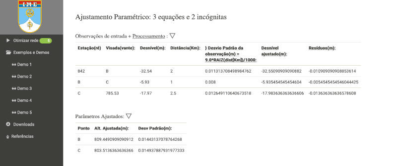
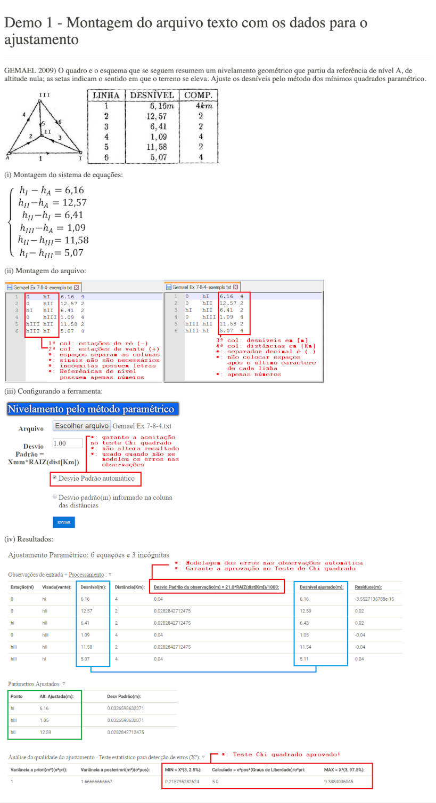
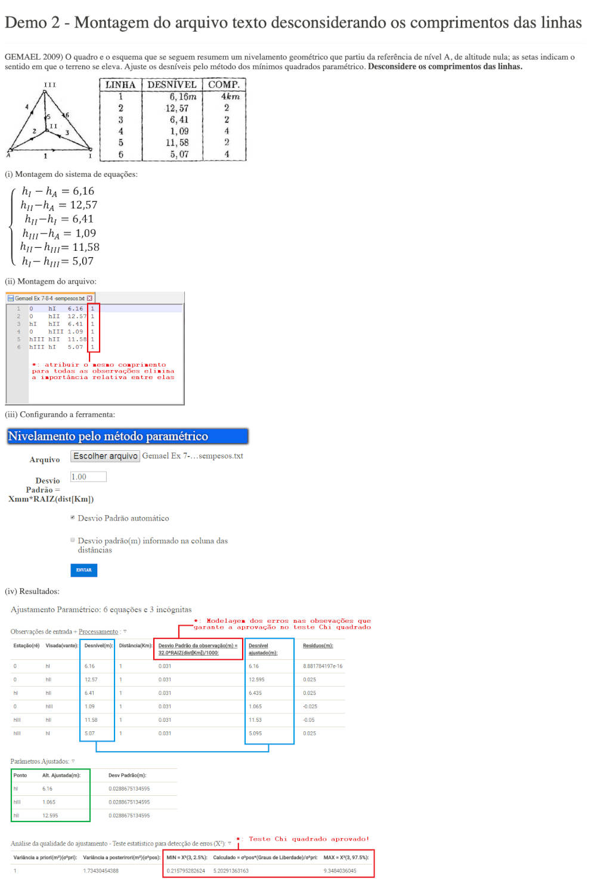
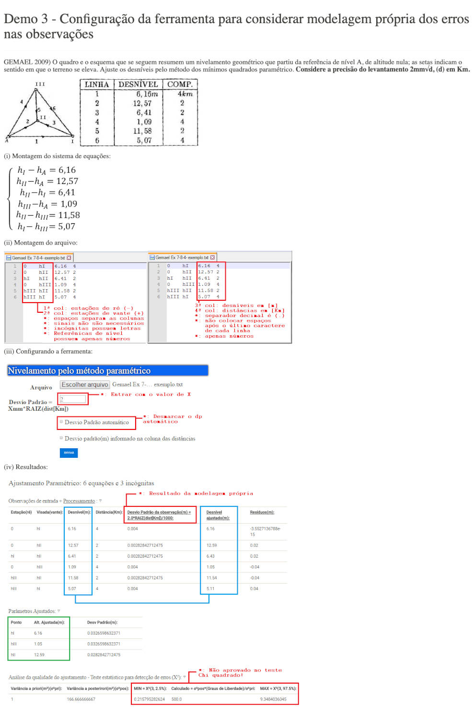
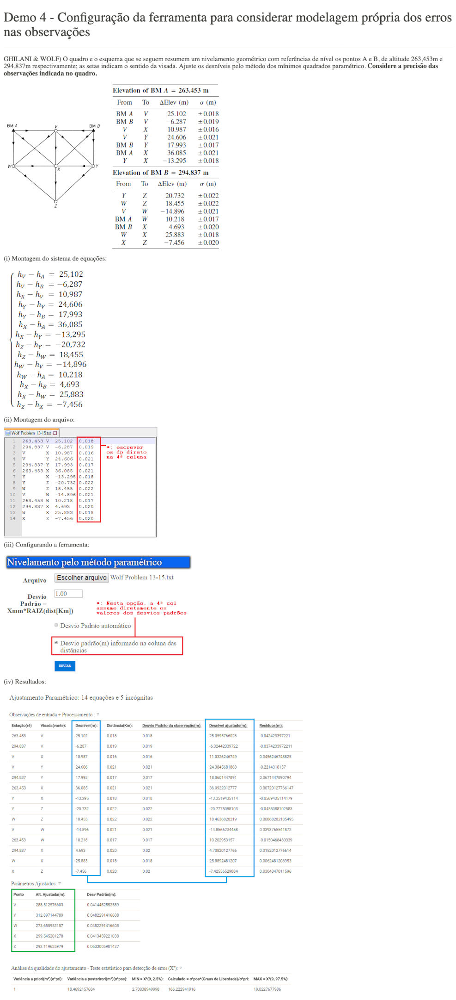
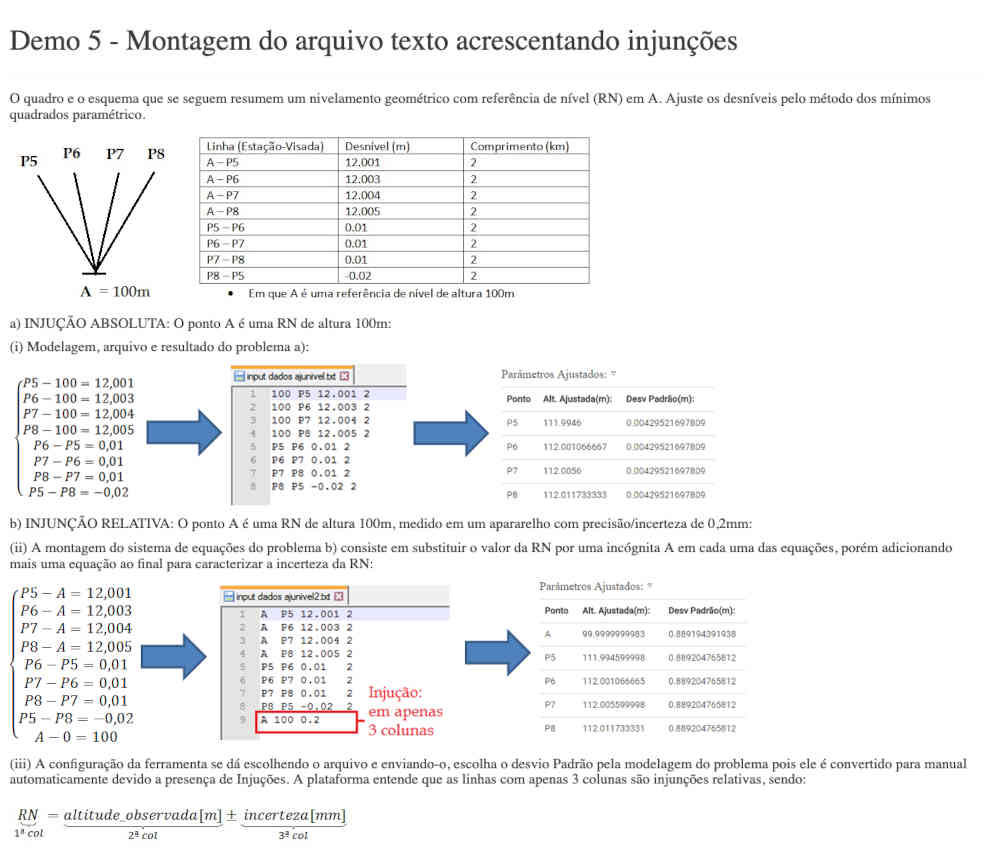

# django-ajustamento-redes-nivelamento
IMPLEMENTAÇÃO DE SISTEMA PARA CÁLCULOS GEODÉSICOS EM AMBIENTE COMPUTACIONAL LIVRE: AJUSTAMENTO DE REDE DE NIVELAMENTO GEOMÉTRICO 

Trabalho de conclusão de curso de: Humberto Diego Aguiar Alves
Orientadores: Prof. Leonardo Castro de Oliveira
              Profª. Heloísa Alves Silva Marques

## 1. Instalação

## 2. Utilização

No formulário, envie um arquivo texto formatado contendo as equações e as variáveis a serem ajsutadas. Deixe o checkbox `automático==True` para testar os desvios-padrões que passam no Teste-Chi Quadrado.

Siga as instruções das imagens abaixo para formatar adequadamente o arquivo texto:

