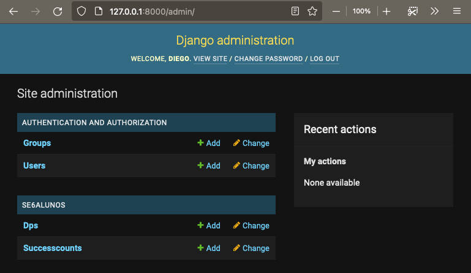
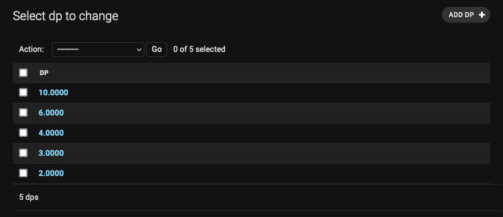

# se6alunos

Conversão do projeto se6alunos de Web2py para Django

## 0. Preparo para utilização sempre de python3

    > which python # checar se é um v2 ou v3
    > which python3
    > echo "alias python=/usr/local/bin/python3" >> ~/.bashrc
    > echo "alias python=/usr/local/bin/python3" >> ~/.zshrc

## 1. Instalação do projeto base Django: 

`django-admin startproject papiroDjango`

`python manage.py startapp se6alunos`

`python manage.py migrate`

`python manage.py createsuperuser --username=diego --email=humberto-xingu@live.com`

`python manage.py runserver`

```
Performing system checks...

System check identified no issues (0 silenced).
February 25, 2022 - 20:55:46
Django version 1.11.29, using settings 'papiroDjango.settings'
Starting development server at http://127.0.0.1:8000/
```

Navegar para http://127.0.0.1:8000/admin

## 2. Rodar o primeiro view do app:

* cd se6alunos
* editar views.py
````
# -*- coding: utf-8 -*-
from django.shortcuts import render
from django.http import HttpResponse

def index(request):
    return HttpResponse("Hello, world. You're at the polls index.")
````
* criar se6alunos/urls.py
````
# -*- coding: utf-8 -*-
from django.urls import path
from . import views

urlpatterns = [
    path('', views.index, name='index'),
]
````
* editar urls.py do projeto
````
from django.contrib import admin
from django.urls import include, path

urlpatterns = [
    path('se6alunos/', include('se6alunos.urls')),
    path('admin/', admin.site.urls),
]
````

Navegar para http://127.0.0.1:8000/se6alunos --> Hello, world. You're at the polls index.

## 3. Configurar o banco de dados:

### 3.1 Básico SQLite
No projeto/setting.py já está configurado banco Sqlite

### 3.2 PostgreSQL

* instale as ligações de banco de dados apropriadas

    `pip3 install psycopg2`

* editar settings.py

````
DATABASES = {
    'default': {
        'ENGINE': 'django.db.backends.sqlite3',
        'NAME': BASE_DIR / 'db.sqlite3',
    },
    'post':{
        'ENGINE': 'django.db.backends.postgresql',
        'NAME': 'postgresql',
        'USER': 'username',
        'PASSWORD': 'password',
        'HOST':'localhost',
        'PORT':'5432'
    }
}
````
### 3.3 Criando o modelo do banco SQLite

* editar o arquivo models.py

```
# -*- coding: utf-8 -*-
from django.db import models

class dp(models.Model):
    X = models.DecimalField(max_digits=4,decimal_places=4)
    def __str__(self):
        return self.X

class successcount(models.Model):
    contador = models.CharField(max_length=200)
    def __str__(self):
        return self.contador
```
* editar o arquivo settings.py para installar o seu app --> permite o migration a seguir

```
INSTALLED_APPS = [
    'se6alunos.apps.Se6AlunosConfig',
    ...
```
* Ativando os models

`python manage.py makemigrations se6alunos` 

````
Migrations for 'se6alunos':
  se6alunos/migrations/0001_initial.py
    - Create model dp
    - Create model successcount
````
  
`python manage.py migrate`

### 3.4 Adicionar o app se6alunos no app admin

* editar o arquivo se6alunos/admin.py

```
from django.contrib import admin
from .models import dp, successcount

admin.site.register(dp)
admin.site.register(successcount)
```

Navegar para http://127.0.0.1:8000/admin



### 3.5 Adicionar os valores 2.0, 3.0, 4.0, 6.0 e 10.0 pelo app admin



## 4. Configurando o conteúdo estático

* editar settings.py

```
STATICFILES_DIRS = [
   os.path.join(BASE_DIR, "static")
]
```

* criar a pasta se6alunos/static/se6alunos/ e colocar o conteúdo estático nela

* Executar o cmdo para copiar tudo no STATIC_ROOT:

    `python manage.py collectstatic`

## 5. Usar o Django Template system:

* criar a pasta se6alunos/templates

* criar o arquivo se6alunos/templates/se6alunos/index.html --> Dentro do app ele será referenciado como se6alunos/index.html

* editar o template index.html

```

    <ul>
    
        <li><{{ dp.X }}</li>
    
    </ul>

    <p>No dp are available.</p>

```

* ediat novamente o views.py

```
# -*- coding: utf-8 -*-
from django.shortcuts import render
from django.http import HttpResponse
from django.template import loader
from .models import dp

def index(request):
    template = loader.get_template('se6alunos/index.html')
    context = {
        'dps': dp.objects.all(),
    }
    return HttpResponse(template.render(context, request))
```
